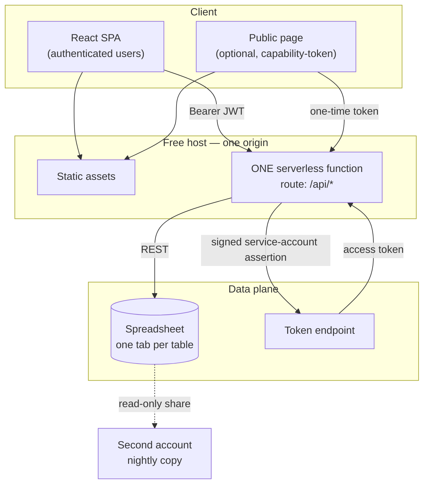

# The Zero-Cost Business App Playbook

A reusable technology plan for building small business applications with **no
database, no server and no monthly bill** — extracted from a production
build and written so it can be applied to a completely different application.

**The pattern in one sentence:** a React single-page app and one serverless
function on a free host, with a spreadsheet as the database, an application
layer that treats that spreadsheet as if it were a real store, and a nightly
copy into a second account so the data outlives the account that holds it.

> **How to use this file.** Copy it into the new project's `docs/`, work through
> the fit test in §3, then follow the build sequence in §23. Everything marked
> **PORT** is code to copy almost unchanged; everything marked **DECIDE** is a
> choice you make per project.

The reference implementation for every pattern here is a production app of this
shape, documented in its own `docs/ARCHITECTURE.md`. This file documents the
*method*.

---

## Table of contents

**Part A — Deciding**
1. [What this playbook is for](#1-what-this-playbook-is-for)
2. [The pattern](#2-the-pattern)
3. [The fit test](#3-the-fit-test)
4. [Cost and capacity model](#4-cost-and-capacity-model)

**Part B — The stack**
5. [Component choices](#5-component-choices)
6. [Repository skeleton](#6-repository-skeleton)
7. [Layer contracts](#7-layer-contracts)

**Part C — The data layer (the reusable core)**
8. [Spreadsheet-as-database rules](#8-spreadsheet-as-database-rules)
9. [Schema definition and migration](#9-schema-definition-and-migration)
10. [The nine primitives to port](#10-the-nine-primitives-to-port)
11. [Identity, soft delete, derived data](#11-identity-soft-delete-derived-data)
12. [The concurrency toolkit](#12-the-concurrency-toolkit)

**Part D — The application layer**
13. [Backend: one function, one router](#13-backend-one-function-one-router)
14. [Auth baseline (hardened)](#14-auth-baseline-hardened)
15. [Public capability links](#15-public-capability-links)
16. [Frontend baseline](#16-frontend-baseline)
17. [Document generation](#17-document-generation)
18. [Importing legacy data](#18-importing-legacy-data)

**Part E — Operating it**
19. [Security baseline checklist](#19-security-baseline-checklist)
20. [Backup and disaster recovery](#20-backup-and-disaster-recovery)
21. [Observability and ops](#21-observability-and-ops)
22. [Testing strategy](#22-testing-strategy)

**Part F — Executing**
23. [Build sequence](#23-build-sequence)
24. [Pre-launch checklist](#24-pre-launch-checklist)
25. [The exit ramp](#25-the-exit-ramp)
26. [Variants and swaps](#26-variants-and-swaps)
27. [Anti-patterns and lessons](#27-anti-patterns-and-lessons)

---

# Part A — Deciding

## 1. What this playbook is for

**The class of application:** an internal operations tool for a small business.
Bookings, jobs, clients, stock, invoices, appointments, memberships,
inspections, deliveries. A handful of named users, a few thousand records a
year, everyone in one time zone.

**What it is not for:** anything with public sign-up, anything where the data is
regulated (health records, card data), anything with real concurrency, anything
that needs sub-100 ms responses, anything with more than a few dozen users.
§3 makes that call properly.

**What you get out of it:**

- A working system in days, not months.
- $0/month hosting, permanently.
- An owner who can open the data in a tool they already understand.
- No servers to patch, no database to maintain, no migrations to run at 2am.
- A clean exit path if the business outgrows it (§25).

**What it costs you:** every action takes 0.5-2 s instead of 20 ms, there are no
transactions, and you must be disciplined about the rules in §8 or the whole
thing quietly corrupts.

---

## 2. The pattern



Four properties define the pattern:

1. **One origin.** The SPA and the API are the same site, so there is no CORS
   dance, no cookie domain problem, and no second deploy target.
2. **One function.** The entire backend is a single file that routes on method +
   path. No framework, no per-route cold starts, no dependency graph to audit.
3. **The store is a document the owner can open.** This is a feature, not a
   compromise — it is what makes the system trustworthy to a non-technical owner
   and survivable when the app breaks.
4. **The application layer pretends the spreadsheet is a database.** Everything
   in Part C exists to make that pretence hold: ids, soft deletes, schema
   migration, locking, idempotency.

---

## 3. The fit test

Score honestly. **Any single red disqualifies the pattern.**

### Green — the pattern fits

| Signal | Threshold |
|---|---|
| Named, trusted users | Under ~25 |
| Concurrent writers at peak | Under ~5 |
| Records per table after 3 years | Under ~20,000 |
| Writes per day | Under ~500 |
| Acceptable action latency | 1-2 s is fine |
| The owner wants to read the raw data | Yes — this is a *reason* to choose it |
| Budget for infrastructure | $0 |
| Someone to run a database | Nobody |

### Amber — possible, with design work

| Signal | What you must add |
|---|---|
| One public write path (a form for outsiders) | The capability-link pattern in §15 — never open a table to the public directly |
| Records approaching 50,000 | Caching, narrower reads, or start planning §25 |
| Users in several time zones | Store UTC everywhere, decide display locale explicitly |
| File uploads needed | Object storage (see §26) — do **not** base64 into cells |
| A second app reads the same data | Read-only API key, or move to a real database now |

### Red — use something else

| Signal | Why | Use instead |
|---|---|---|
| Public sign-up / unbounded users | No rate model, no isolation, PII in a shared document | Postgres + a real auth provider |
| Regulated data (health, card, government id) | The store cannot meet audit, encryption-at-rest-with-key-control or access-log requirements | A compliant managed platform |
| Financial ledger of record | No transactions means a half-applied transfer is possible | A database with ACID guarantees |
| Real concurrency (booking the same seat) | Last write wins; there is no compare-and-swap | Postgres with row locks |
| Sub-100 ms interactions | Every read is a network round trip | Anything with a local cache or real DB |
| Reporting across millions of rows | Full-tab scans | A warehouse |
| More than ~2 write-heavy tables at high volume | API quotas | A database |

**The honest framing:** this pattern trades throughput and guarantees for cost
and legibility. That is the right trade for a shop with three staff. It is the
wrong trade the moment strangers can write to it or money moves through it.

---

## 4. Cost and capacity model

### Cost

| Item | Free tier | Realistic ceiling before you pay |
|---|---|---|
| Static hosting + serverless function | Netlify free: 100 GB bandwidth, 125k function invocations/month | An internal tool with 20 users does maybe 20k invocations/month |
| Spreadsheet store | Google Sheets, free with any account | 10M cells per spreadsheet |
| Scheduled backup | Google Apps Script, free | 90 min/day script runtime |
| Domain | **The only real cost** | ~$12/year, optional |

**Total: $0/month, plus an optional domain.**

### Capacity — the numbers that actually bind

| Limit | Value | What hits it |
|---|---|---|
| Sheets API requests | ~300/min per project, 60/min per user | A bulk import; a page that fires many calls at once |
| Cells per spreadsheet | 10,000,000 | 20 columns x 500,000 rows — not your constraint |
| Function timeout | ~10 s (Netlify), 30 s configurable elsewhere | Any per-row loop over a large table |
| Function memory | 1 GB | Generating large documents |
| Practical rows per tab | ~20,000 comfortable, ~50,000 painful | Full-tab reads |
| Round trip per store call | 200-600 ms | Everything |

### The latency budget

Design every endpoint to a budget of **at most three store calls**:

```
1 call  = ~0.4 s   good
2 calls = ~0.8 s   fine
3 calls = ~1.2 s   acceptable
5+ calls           redesign — batch, parallelise, or denormalise
```

Techniques that keep you inside it:

- `Promise.all` for independent reads (the reference app reads two tables in
  parallel to compute balances).
- `values:batchGet` for several ranges in one call.
- One `batchUpdate` for many cell writes instead of N row updates.
- Chunked appends (500 rows per call) for imports.
- Never loop `await` over rows. **This is the single most common way to blow the
  function timeout.**

---

# Part B — The stack

## 5. Component choices

| Concern | Choice | Why | Swap-in alternatives |
|---|---|---|---|
| UI | React + TypeScript | Ubiquitous, hireable, typed | Svelte, Vue, Preact |
| Build | Vite | Fast, zero-config, first-class TS | — |
| Styling | One hand-written CSS file | No build weight, no framework churn, full control | Tailwind if the team knows it |
| Routing | **None** — read `window.location` at boot | An internal tool has one shell and a tab state; a router is overhead | React Router when you truly need deep links |
| State | `useState` + `useMemo`, props down | The dataset is loaded once and derived; a store is overhead | TanStack Query if you add many endpoints |
| Backend | One serverless function, hand-rolled router | No framework to learn, audit or update | Hono if you want middleware |
| Runtime | Node 20+, ES modules | Web `Request`/`Response` available | Deno, Bun |
| Store | Google Sheets via REST | Free, owner-readable, no SDK needed | Airtable, Turso, SQLite-on-object-storage (§26) |
| Auth | JWT (HS256) + bcrypt in a users table | No external dependency, no per-user cost | Auth0/Clerk if you need SSO or sign-up |
| Docs | docxtemplater + PizZip | Word templates the owner can edit herself | Puppeteer→PDF, ReportLab |
| Dates | `date-fns` on the client; hand-rolled parser on the server | Server must accept messy legacy input | Luxon |
| Lint | oxlint | Fast, catches hook rule violations | ESLint |
| Tests | Node's built-in runner | No dependency | Vitest |
| Backup | Apps Script on a timer, in a second account | Different failure domain, free | Any scheduled export |

**Deliberate omissions**, each one a dependency you do not have to maintain: no
ORM, no state library, no CSS framework, no component library, no API client
generator, no Docker, no CI beyond the host's build, no `googleapis` SDK (the
service-account assertion is 25 lines of `node:crypto`).

**DECIDE per project:** the store (§26), whether you need public links (§15),
whether you need document generation (§17).

---

## 6. Repository skeleton

Copy this shape. It is the whole architecture, expressed as folders.

```
<project>/
├─ netlify.toml                Build, bundling, redirects, security headers
├─ package.json                Backend deps only (auth, docs) — keep this list tiny
├─ tsconfig.json
├─ .env.example                EVERY variable, documented, no values
├─ .gitignore                  .env, .env.*, !.env.example, service-account.json
│
├─ netlify/functions/
│  └─ api.ts                   The entire backend. Routing + gates only.
│
├─ lib/                        Backend logic. No HTTP types, no React.
│  ├─ sheets.ts                PORT — store primitives, schema bootstrap, auth to the store
│  ├─ errors.ts                PORT — { status, detail } contract
│  ├─ dates.ts                 PORT — loose date/money parsing
│  ├─ auth.ts                  PORT — JWT + bcrypt + roles
│  ├─ locks.ts                 PORT — single-flight and named operation locks
│  ├─ stores.ts                DECIDE — YOUR DOMAIN. One section per table.
│  ├─ types.ts                 DECIDE — your domain shapes and constants
│  └─ <feature>.ts             DECIDE — one file per non-trivial feature
│
├─ templates/                  Optional: .docx/.xlsx templates shipped with the function
│
├─ client/
│  ├─ vite.config.ts
│  └─ src/
│     ├─ main.tsx              Root selection (app / public page / public host)
│     ├─ App.tsx               Shell, navigation, shared state, role gating
│     ├─ styles.css
│     ├─ auth/                 AuthContext, LoginPage
│     ├─ lib/                  api.ts, types.ts, utils.ts, derived-data helpers
│     └─ views/                One file per tab/screen
│
├─ scripts/
│  ├─ dev-server.mjs           PORT — local function host
│  ├─ backup.gs                PORT — scheduled backup, runs in the second account
│  ├─ backup.test.mjs          PORT — tests for the backup logic
│  └─ migrate-*.mjs            DECIDE — one-time legacy import
│
└─ docs/
   ├─ ARCHITECTURE.md          Written as you build, not after
   ├─ BACKUP.md                Setup + restore runbook
   └─ TECH-STACK-PLAYBOOK.md   This file
```

**The rule that keeps it clean:** `netlify/functions/api.ts` contains *no
business logic* — only routing, auth gates and response shaping. Everything else
lives in `lib/` and is testable without HTTP.

---

## 7. Layer contracts

| Layer | May know about | Must never know about |
|---|---|---|
| `lib/sheets.ts` | The store's API, tabs, rows, cells | Bookings, invoices, any domain noun |
| `lib/stores.ts` | Domain rules, `sheets.ts` primitives | HTTP, `Request`, status codes (it throws typed errors instead) |
| `netlify/functions/api.ts` | HTTP, roles, routing, `stores.ts` | How anything is stored |
| `client/src/lib/api.ts` | Endpoints, the token, error shape | The store, the domain rules |
| `client/src/views/*` | Props and the api client | `fetch`, tokens, storage |

Test this by asking: **could I replace the spreadsheet with Postgres by rewriting
one file?** If yes, the contract holds. That is also your exit ramp (§25).

---

# Part C — The data layer (the reusable core)

This part is the transferable value. Port it almost verbatim.

## 8. Spreadsheet-as-database rules

### The four invariants

**1. Columns are read by POSITION, never by name.**
The header row is documentation for humans; the code indexes by column number.
Consequence: **new columns are only ever appended to the right.** Inserting a
column in the middle silently shifts every value in every row of that table.
Write this in the operator runbook and on the sheet itself.

**2. Every write is RAW.**
Never let the store interpret values. An ISO date stays the string `2026-02-01`.
A value starting with `=` stays inert text — which also means a malicious form
submission cannot inject a live formula into the owner's document. (Note the
residual: someone exporting to CSV and opening it in Excel can still be attacked
by a leading `=`, `+`, `-` or `@`. If you export CSV, prefix such values with a
single quote.)

**3. Never physically delete a row that anything points to by position.**
Soft-delete with a `DeletedAtUtc` column. A hard delete shifts every row below
it, and any in-flight operation or stored row-locator then addresses the *wrong
record*. Hard deletion is only safe for tables nothing locates by row number.

**4. Store nothing derived.**
Balances, totals, statuses, conflict flags: compute on read. A stored aggregate
desynchronises the moment someone edits a cell by hand — and someone will.

### Naming conventions

| Thing | Convention | Example |
|---|---|---|
| Tab | Singular concept, plural name, PascalCase | `Invoices` |
| Column | PascalCase, no spaces | `CreatedAtUtc` |
| Primary key | Always `Id`, always first | `Id` |
| Timestamps | Suffix `AtUtc`, ISO 8601, always UTC | `CreatedAtUtc`, `DeletedAtUtc` |
| Dates | ISO `yyyy-MM-dd` as text | `DueDate` |
| Booleans | Text `TRUE` / `FALSE` | `IsDisabled` |
| Foreign key | `<Table-singular>Id` | `InvoiceId` |
| JSON blobs | Suffix `Json` | `ValuesJson` |
| Money | Plain number, no symbol, no separators | `1200` |

### The template table

Every table you design starts from this and adds columns:

| Col | Header | Purpose |
|---|---|---|
| A | `Id` | Primary key, `max+1` |
| B | `CreatedAtUtc` | ISO 8601 |
| ... | *your fields* | |
| last-1 | `UpdatedBy` | **Add this.** Who last changed it. The reference app lacks it and regrets it. |
| last | `DeletedAtUtc` | Soft delete. Blank = active. |

Synthetic example of a generic `Items` tab:

```
Id | CreatedAtUtc             | Name    | Amount | DueDate    | UpdatedBy | DeletedAtUtc
1  | 2026-01-15T09:00:00.000Z | Example | 100    | 2026-02-01 | admin     |
```

---

## 9. Schema definition and migration

**PORT.** The schema is one constant. It is the single source of truth for
column order, and the migration mechanism reads it.

```ts
export const TABS = {
  Items: ['Id', 'CreatedAtUtc', 'Name', 'Amount', 'DueDate', 'UpdatedBy', 'DeletedAtUtc'],
  Users: ['Username', 'PasswordHash', 'Role', 'IsDisabled', 'TokenVersion', 'CreatedAtUtc'],
} as const

export type TabName = keyof typeof TABS
```

### Bootstrap and migration in one mechanism

On cold start, `ensureSchema()`:

1. Reads the spreadsheet's tab list.
2. Creates any missing tab and writes its header row.
3. For existing tabs, compares the header row to `TABS`:
   - **Exact match** → nothing to do.
   - **Existing headers are an exact prefix of the expected list, and the new
     columns hold no data** → append the missing header names. *This is your
     entire migration story: add a column to `TABS`, deploy, done.*
   - **Anything else** → throw a `503` that explains the problem and **write
     nothing**. Never relabel a column that might be the owner's own.

**PORT this guard exactly.** Refusing to touch an unexpected schema is what stops
a deploy from destroying a customer's manual additions.

```ts
let ensured = false
let ensuring: Promise<void> | null = null

// Single-flight: `ensured` can only flip after two awaits, so without this
// every concurrent request during a cold start issues its own addSheet for the
// same missing tab — and the store resolves duplicate titles by creating empty
// "<title>_conflict<id>" copies.
export function ensureSchema(): Promise<void> {
  if (ensured) return Promise.resolve()
  if (!ensuring) {
    ensuring = bootstrapSchema().then(
      () => { ensured = true; ensuring = null },
      err => { ensuring = null; throw err },
    )
  }
  return ensuring
}
```

### Migration rules

| Change | Allowed? | How |
|---|---|---|
| Add a column | Yes | Append to `TABS`, deploy |
| Add a table | Yes | Add to `TABS`, deploy |
| Rename a column | Header only | Data is positional; renaming the header is cosmetic |
| Reorder columns | **No** | Would shift all data |
| Remove a column | **No** — deprecate instead | Leave it, stop writing it, note it in docs |
| Change a column's type | Careful | Write a one-off script; the parsers should tolerate both |

---

## 10. The nine primitives to port

Everything the domain layer needs, in one file. **PORT all nine.**

| # | Primitive | Signature | Notes |
|---|---|---|---|
| 1 | `getAccessToken()` | `() => Promise<string>` | Signs a service-account assertion with `node:crypto`; caches the token in module scope until 60 s before expiry |
| 2 | `cellText(cell)` | `(unknown) => string` | Normalises every cell to a trimmed string; numbers become `"46282"`, not `"46282.0"` |
| 3 | `readTable(tab)` | `(TabName) => Promise<TableRow[]>` | Full-tab read; skips all-blank rows; returns `{rowNumber, cells}` |
| 4 | `readTableRow(tab, n)` | `(TabName, number) => Promise<TableRow \| null>` | One row without scanning — essential for capability links (§15) |
| 5 | `appendRows(tab, rows)` | chunks of 500 | One call per chunk, never per row |
| 6 | `updateRow(tab, n, values)` | whole row | Full-record update |
| 7 | `updateCells(updates[])` | selective, atomic | **The most important one** — targeted writes that never clobber neighbours |
| 8 | `deleteRow(tab, n)` | hard delete | Only for tables nothing locates by row number |
| 9 | `nextId(rows)` | `max(Id) + 1` | Always call inside a lock (§12) |

### Auth to the store, without an SDK

**PORT.** 25 lines replace a large dependency:

```ts
import { createSign } from 'node:crypto'

const b64url = (d: Buffer | string) => Buffer.from(d).toString('base64url')

async function getAccessToken(): Promise<string> {
  if (cached && Date.now() < cached.expiresAt - 60_000) return cached.token

  const sa = loadServiceAccount()               // raw JSON or base64 of it
  const now = Math.floor(Date.now() / 1000)
  const header = b64url(JSON.stringify({ alg: 'RS256', typ: 'JWT' }))
  const claims = b64url(JSON.stringify({
    iss: sa.client_email, scope: SCOPE, aud: TOKEN_URL, iat: now, exp: now + 3600,
  }))
  const signer = createSign('RSA-SHA256')
  signer.update(`${header}.${claims}`)
  const assertion = `${header}.${claims}.${signer.sign(sa.private_key).toString('base64url')}`

  const res = await fetch(TOKEN_URL, {
    method: 'POST',
    headers: { 'Content-Type': 'application/x-www-form-urlencoded' },
    body: new URLSearchParams({
      grant_type: 'urn:ietf:params:oauth:grant-type:jwt-bearer', assertion,
    }),
  })
  if (!res.ok) throw new ConfigurationError(`Token exchange failed (${res.status})`)
  const data = await res.json()
  cached = { token: data.access_token, expiresAt: Date.now() + data.expires_in * 1000 }
  return data.access_token
}
```

### Selective writes

**PORT.** This is what makes concurrent edits survivable:

```ts
export type CellUpdate = {
  tab: TabName; rowNumber: number; columnNumber: number; value: string | number
}

// One atomic batchUpdate. Unlike updateRow, this never replaces neighbouring
// cells — so a background change to one field cannot roll back a user's
// unrelated edit made a second earlier.
export async function updateCells(updates: CellUpdate[]): Promise<void> { /* ... */ }
```

Rule of thumb: **use `updateRow` for user-initiated full-record saves, and
`updateCells` for every state transition.**

### Error translation

**PORT.** Turn store failures into operator instructions, not stack traces:

```ts
if (res.status === 403 || res.status === 404) {
  throw new ConfigurationError(
    `Store request failed (${res.status}). Check SPREADSHEET_ID is correct and the ` +
    `document is shared with the service account as Editor.`)
}
```

Misconfiguration should always be a **503 with the fix in the message**, never a
401 or a generic 500. This single habit removes most support calls.

---

## 11. Identity, soft delete, derived data

### Ids

`max(Id) + 1`, computed inside a lock. Simple, human-readable, sortable, and
matches what the owner sees in the document.

**Known weakness:** two function instances can allocate the same id in the same
instant. At this scale it is improbable and the consequence is a duplicate id,
not data loss. If you cannot accept it, use one of:

- a dedicated `Counters` tab written under a lock (still cross-instance racy);
- a ULID/UUID (loses human readability — a real cost for an owner reading raw
  data);
- accept it and add a nightly duplicate-id check to the backup script.

### Soft delete

One helper, used by **every** read path:

```ts
const isActive = (row: TableRow) => !row.cells.DeletedAtUtc?.trim()
```

Then: lists, lookups, foreign-key validation, aggregates, exports and
de-duplication all filter through it. Archiving a record removes it from
everything at once, and restoring puts it back everywhere at once — including,
deliberately, back into any warnings it used to trigger.

Archive by writing **only** the `DeletedAtUtc` cell (`updateCells`), so row
positions never move.

### Derived data

Compute on read, always:

```ts
// Never store a balance. Two parallel reads and a Map.
const [rows, payments] = await Promise.all([readTable('Invoices'), readTable('Payments')])
const paid = new Map<number, number>()
for (const p of payments) {
  const id = Number(p.cells.InvoiceId), amt = Number(p.cells.Amount)
  if (Number.isFinite(id) && Number.isFinite(amt)) paid.set(id, (paid.get(id) ?? 0) + amt)
}
```

Two reads in parallel cost one round trip. A stored total costs correctness.

---

## 12. The concurrency toolkit

The store has **no transactions and no compare-and-swap**. These five patterns
are how you cope. **PORT all five.**

### 1. Single-flight (`ensureSchema`)

Concurrent callers share one in-flight promise. Prevents duplicate bootstrap.
Code in §9.

### 2. Named operation locks

Serialises operations *within one warm instance*:

```ts
const operationLocks = new Map<string, Promise<void>>()

export async function withOperationLock<T>(key: string, op: () => Promise<T>): Promise<T> {
  const previous = operationLocks.get(key) ?? Promise.resolve()
  let release!: () => void
  const gate = new Promise<void>(resolve => { release = resolve })
  const queued = previous.then(() => gate)
  operationLocks.set(key, queued)
  await previous
  try {
    return await op()
  } finally {
    release()
    if (operationLocks.get(key) === queued) operationLocks.delete(key)
  }
}
```

Key conventions: `'<entity>:create'` (global, protects `nextId`) and
`'<entity>:id:<id>'` (per record). Never put a secret in a lock key — hash it
first.

### 3. Version nonce + witness

For any record an outside party can act on, carry a version:

```ts
// Opaque revision nonce; equality matters, not ordering.
function newVersion(): number {
  let v = 0
  while (v === 0) v = randomBytes(6).readUIntBE(0, 6)
  return v
}
```

The client echoes the version it was rendered with; the server rejects a mismatch
with `409 "This form was updated. Reload it before submitting."` Combine with
`UpdatedAtUtc` as a second witness.

### 4. Re-read before write

After validation that involved I/O, **read the record again** and confirm nothing
material changed before committing:

```ts
const latest = await requireRecord(id)
if (latest.status !== expected.status
  || latest.version !== envelope.version
  || latest.updatedAtUtc !== expected.updatedAtUtc) {
  throw new HttpError(409, 'This changed while it was being saved. Reload and try again.')
}
await updateCells([...])
```

### 5. Idempotency keys

Any multi-step operation stores the key of what caused it, and checks for it
first:

```ts
// The child row records its cause. If step 2 failed after step 1 succeeded,
// retrying returns the existing child instead of creating a second one.
const existing = rows.find(r => Number(r.cells.SourceRequestId) === requestId)
if (existing && isActive(existing)) return toDomain(existing)
```

### What remains possible — document it

| Residual risk | Consequence | Accepted because |
|---|---|---|
| Cross-instance id collision | Duplicate id | Improbable at this scale |
| Last write wins | A simultaneous edit is silently overwritten | Few users, rarely the same record |
| Partial multi-step write | An intermediate state persists | Every step is idempotent on retry |

Put this table in the project's own `ARCHITECTURE.md`. Undocumented accepted risk
becomes a bug report later.

---

# Part D — The application layer

## 13. Backend: one function, one router

**PORT the shape.** One file, one exported handler.

```ts
export const config = { path: '/api/*' }

export default async function handler(req: Request): Promise<Response> {
  if (req.method === 'OPTIONS') return new Response(null, { status: 204, headers: CORS })
  try {
    return await route(req)
  } catch (e: any) {
    if (e instanceof HttpError) return json({ status: e.status, detail: e.message }, e.status)
    console.error('Unhandled error:', e)
    return json({ status: 500, detail: 'An unexpected error occurred. Check the logs.' }, 500)
  }
}

async function route(req: Request): Promise<Response> {
  const path = apiPath(req)                 // strip prefix + trailing slashes
  const method = req.method.toUpperCase()

  // 1. Public routes FIRST, each an explicit, commented exception.
  if (method === 'POST' && path === '/auth/login') { /* ... */ }

  // 2. The gate. Everything below requires a valid token.
  const user = authenticate(req)

  // 3. Routes, with requireAdmin(user) inline where privilege is needed.
  //    Order matters: match literal paths before parameterised ones.
  if (path === '/items/archived' && method === 'GET') { requireAdmin(user); /* ... */ }
  const m = path.match(/^\/items\/(\d+)$/)
  if (m) { /* ... */ }

  return json({ status: 404, detail: `Not found: ${method} ${path}` }, 404)
}
```

**Rules:**

- Public routes sit above the auth gate and each carries a comment saying why. A
  reviewer can then audit the public surface by reading the top of one function.
- Literal paths match before parameterised ones (`/items/archived` before
  `/items/:id`).
- The router shapes responses; it never contains business logic.
- Role checks are inline and visible at the route, not hidden in middleware.

### The error contract

**PORT.** Every error is `{ status, detail }`:

```ts
export class HttpError extends Error {
  constructor(public status: number, detail: string) { super(detail) }
}
export class ValidationError extends HttpError {   // 400 — collect ALL errors
  constructor(errors: string[]) { super(400, errors.join(' ')) }
}
export class NotFoundError extends HttpError { constructor(d: string) { super(404, d) } }
export class ConfigurationError extends HttpError { constructor(d: string) { super(503, d) } }
```

Validation collects every problem and returns them together. Users fix one form
once, not five times.

### Validation pattern

**PORT.** One function per entity, returning a *narrowed* type:

```ts
function validateItem(input: ItemInput): ValidatedItem {
  const errors: string[] = []
  if (!input.name?.trim()) errors.push('Name is required.')
  if (input.amount != null && input.amount < 0) errors.push('Amount cannot be negative.')
  const due = parseInputDate(input.dueDate, 'Due date', errors)
  if (errors.length > 0) throw new ValidationError(errors)
  return { name: input.name!.trim(), amount: input.amount ?? null, dueDate: due }
}

// Same rules, no write — so a public form can pre-validate with identical logic.
export function assertValidItemInput(input: ItemInput): void { validateItem(input) }
```

That second export is what lets an outsider's form fail *before* it closes, using
the exact rules that will run at commit time. Do not duplicate validation.

---

## 14. Auth baseline (hardened)

The reference implementation is JWT + bcrypt in a users table. **This section
includes the fixes it lacks — start here, not there.**

### Base

- **bcrypt cost 10.** Hashes never leave the server.
- **JWT HS256, 8-hour expiry**, claims `sub`, `roles`, `tv` (see below).
- **Secret at least 32 chars**, enforced — throw `503` if not.
- **Uniform 401** on bad credentials. Never distinguish "no such user" from
  "wrong password".
- **First-run seeding** from env vars, and **only when the users table is
  empty**.
- **Self-disable blocked** — nobody locks themselves out.
- **Case-insensitive usernames.**

### Fix 1 — token revocation (`TokenVersion`)

The reference app cannot revoke a session: disabling a user leaves their token
valid for up to 8 more hours. Add a `TokenVersion` integer column to `Users`:

```ts
// On login:
jwt.sign({ sub: user.username, roles: [user.role], tv: user.tokenVersion }, secret, ...)

// In authenticate(), after verifying the signature:
const user = await findUser(payload.sub)
if (!user || user.isDisabled || user.tokenVersion !== payload.tv) {
  throw new HttpError(401, 'Session ended — please log in again.')
}
```

Increment `TokenVersion` on disable, password reset and password change. Cost:
one extra table read per request — mitigate with a short in-instance cache (30 s)
if latency matters.

### Fix 2 — login rate limiting

Apply the same window used for public routes to `/auth/login`. Key on IP **and**
on the attempted username, so one attacker cannot lock out a whole office and one
account cannot be sprayed from many IPs.

### Fix 3 — a real password policy

12 characters minimum, and check against a breached-password list at
account-creation time. Eight characters with no other rule is not a policy.

### Fix 4 — let users change their own password

The reference app makes password change Admin-only (inherited from its
predecessor). Unless you have a specific reason, let every user rotate their own
credential.

### Roles

Two roles is usually right: **Operator** (daily work) and **Owner** (money,
history, configuration, users). Enforce server-side at every privileged route;
treat the UI's hiding of tabs as cosmetic only.

Design the matrix as a business sentence before you write code. The reference
app's is: *"staff take bookings and take money; the owner changes history and
sees the money."* Write yours down in `ARCHITECTURE.md`.

---

## 15. Public capability links

**The generalised pattern:** you need an outsider — a customer, a supplier, a
candidate, a tenant — to supply data *once*, without an account.

Applications: a booking confirmation form, a supplier price update, an intake
questionnaire, a document-signing request, a delivery address confirmation, a
review invitation.

### The eight rules

1. **A staging table, never the real one.** The outsider writes to
   `<Entity>Drafts`. Nothing reaches the operational table until a human
   approves it. This is the whole security model in one decision.
2. **The operator chooses which fields are editable**, per request. Store that
   list. The submission handler rejects any key not on it, **by name**.
3. **Capability token = row locator + 256 random bits.**
   ```
   r<rowNumber>.<43 base64url chars>     // crypto.randomBytes(32)
   ```
   The locator is not secret; it exists so a public hit reads **one row** instead
   of scanning the table.
4. **Store only `SHA-256(token)`.** A leaked store yields no working links.
   Validate the token's *format* with a regex before any I/O, so junk costs
   nothing.
5. **Short TTL, one-time use.** Default 72 hours. Reissuing invalidates the old
   token; deleting blanks the hash, killing the link immediately. An unparseable
   or missing expiry counts as expired — **fail closed**.
6. **Narrow projection out.** Return only what the page must render. Never the
   token hash, internal timestamps, decision metadata or soft-delete state. Send
   `Cache-Control: no-store`.
7. **Uniform errors.** Expired, deleted, already-used and never-existed must be
   indistinguishable from outside. Collapse everything to a small set of codes
   and one message: *"This link is no longer available."*
8. **Rate limit the public routes.** Per IP, per minute. Accept that an in-memory
   limiter is best-effort and per-instance; keep the platform's limiter on as the
   real control.

### The submission validation ladder

Run in this order — cheapest and most decisive first:

```
1. Token format regex                      (no I/O)
2. Rate limit                              (no I/O)
3. Token resolves, not deleted, hash match (1 read)
4. Status pending, not expired             (in memory)
5. Envelope shape: exactly {values, version}
6. Version matches
7. Field allow-list: exactly the permitted keys, no more, no fewer
8. Per-field: type, length cap, format, range
9. Cross-field: the SAME validator the real create uses
10. Re-read; if status/version/permitted-fields changed → 409
11. Write, selectively, in one atomic call
```

### Soft delete is mandatory here

Because the token embeds a row number, a deleted draft **must** keep its row.
Otherwise a live token in someone's inbox could later resolve to a different
person's record. Blank the hash instead.

### State machine

Model it explicitly and write it into the docs:

```
draft → pending → submitted → approved
                            → rejected → pending (new token)
        pending → expired   → pending (new token)
```

Reject transitions that are not on the diagram with `409`, and treat any
unrecognised stored status as the most restrictive state.

---

## 16. Frontend baseline

### Root selection instead of a router

```tsx
const path = window.location.pathname.replace(/\/+$/, '') || '/'
const isPublicForm = path.startsWith('/fill/')
const isPublicHost = PUBLIC_HOSTS.includes(window.location.hostname.toLowerCase())

const root = isPublicForm ? <PublicFormPage token={tokenFrom(path)} />
  : isPublicHost         ? <PublicHomePage />
  : <AuthProvider><App /></AuthProvider>
```

Three mutually exclusive roots, resolved before React renders. The public form
never mounts the auth provider — so it cannot touch, refresh or clear the
operator's session.

### The API client

**PORT.** Two request functions, deliberately separate:

```ts
async function request(path, init)        // attaches Bearer; 401 → clear token + logout
async function publicRequest(path, init)  // NEVER attaches a token; NEVER triggers logout
```

That separation matters: without it, an expired public link open in another tab
signs the operator out. Also give `login()` a bare `fetch`, so a stale token
cannot interfere with signing in.

### State

Load the main dataset once (`refresh()`), pass it down, derive everything with
`useMemo`. Refetch after every mutation rather than patching local state — at
this scale a refetch is one round trip and it removes a whole class of stale-UI
bugs.

### Two UI rules worth stealing

1. **Confirm ambiguous input in words.** Browsers render `<input type="date">` in
   the viewer's locale, so `09/04/2026` means different days in different
   countries. Render `Friday 4 September 2026` underneath. Cheap; prevents the
   most expensive class of data-entry error.
2. **Warn, don't block, on unusual-but-legal input.** A 40-day rental or a
   10x-normal price is probably a typo — flag it, let them proceed.

### Mobile

Pick the 3-5 screens actually used on a phone and put them in a bottom bar; move
the rest into a grouped "More" sheet. Do not remove capability on small screens —
only distance.

---

## 17. Document generation

If the business produces paperwork — contracts, receipts, work orders,
certificates:

- **Template files, not code.** `docxtemplater` + `PizZip` with `{{ }}`
  delimiters. The owner edits the wording in Word without a deploy. This is a
  much bigger win than it sounds.
- `nullGetter: () => ''` so a missing value leaves a blank, never `undefined`.
- Ship the template with the function (`included_files`), and resolve its path
  against several candidates — bundler layouts differ between local dev and
  deploy.
- **Sanitise the filename**: strip `\ / : * ? " < > |` from any user value.
- Return `Content-Disposition: attachment; filename*=UTF-8''<encoded>` and expose
  that header in CORS so the browser can read the name.
- A render failure is a `422` naming the template problem, not a 500.
- On the client, show a loading state — generation takes a second or two and
  otherwise looks like a freeze.

---

## 18. Importing legacy data

Almost every one of these projects replaces a spreadsheet, a form-responses
sheet, or an old app's database. Build the importer as a **first-class,
rerunnable feature**, not a one-off script.

1. **Map columns by normalised header text** (lowercased, whitespace-collapsed),
   never by position — legacy sheets have columns inserted at random over the
   years.
2. **Store the provenance.** An `ImportedSourceRow` column on each imported
   record makes the import **idempotent**: re-running skips what is already there
   and reports `{imported, skipped}`.
3. **Parse leniently.** Legacy data holds serial numbers, ISO dates, `d/m/y`,
   `m/d/y`, `1,200 USD` and blanks. Write one tolerant parser and unit-test it
   against the real mess. Decide the ambiguity default explicitly — and write
   down which you chose.
4. **Batch the writes.** One append per 500 rows. Per-row writes will exceed the
   function timeout and import half the data.
5. **Skip empty rows** and rows with no identifying field.
6. **Run it twice on a copy before you run it once on the real thing.**

---

# Part E — Operating it

## 19. Security baseline checklist

Every item is either "done in the reference implementation" or "a gap it has".
**Start a new project with all of them.**

### Transport and headers

- [ ] HTTPS only; the host provides it.
- [ ] **Security headers in `netlify.toml`** — the reference app has none:
  ```toml
  [[headers]]
    for = "/*"
    [headers.values]
      Content-Security-Policy = "default-src 'self'; img-src 'self' data:; style-src 'self' 'unsafe-inline'; object-src 'none'; frame-ancestors 'none'; base-uri 'self'"
      X-Content-Type-Options = "nosniff"
      Referrer-Policy = "no-referrer"
      X-Frame-Options = "DENY"
      Permissions-Policy = "geolocation=(), camera=(), microphone=()"
  ```
  `Referrer-Policy: no-referrer` matters most when capability tokens live in
  URLs.
- [ ] **CORS restricted to your own origin(s)**, not `*`. The reference app uses
  `*`; because auth is a bearer header rather than a cookie this is not CSRF, but
  it removes a free layer for no benefit.

### Identity

- [ ] Secret >= 32 chars, enforced at startup.
- [ ] Token TTL <= 8 h.
- [ ] **`TokenVersion` revocation** (§14, fix 1).
- [ ] **Login rate limited** by IP and by username (§14, fix 2).
- [ ] Password policy >= 12 chars + breach check.
- [ ] Seed admin password set explicitly — never rely on a default.
- [ ] Hashes never returned by any endpoint.

### Authorization

- [ ] Every privileged route calls the role check server-side.
- [ ] Public routes are grouped above the auth gate, each with a comment.
- [ ] Write the role matrix into the docs.

### Input

- [ ] Allow-list, never deny-list: unknown fields rejected **by name**.
- [ ] Length cap on every text field.
- [ ] Numbers checked finite and in range.
- [ ] Dates parsed and normalised before storage.
- [ ] All writes RAW so no formula can be injected.
- [ ] Filenames sanitised.
- [ ] If you ever export CSV, prefix `=`, `+`, `-`, `@` with `'`.

### Output

- [ ] Error messages carry no internals; 500s point at the logs.
- [ ] Public errors are uniform and non-enumerable.
- [ ] Public responses `no-store`.
- [ ] Projections are narrow — build the response object explicitly rather than
      spreading a stored record.

### Secrets and store

- [ ] `.env*` git-ignored; only `.env.example` committed.
- [ ] No secret in a `VITE_`/client-visible variable.
- [ ] Service-account key scoped to the one document.
- [ ] **Access to the store document is treated as a primary control** — it
      bypasses every rule above. Audit who has it, quarterly.
- [ ] The backup account is Viewer-only with 2FA.
- [ ] Credential-rotation procedure written down.

### Audit

- [ ] `UpdatedBy` / `DeletedBy` columns on every table that matters. The
      reference app lacks these and cannot answer "who archived this?"

---

## 20. Backup and disaster recovery

**The store is a document, so back it up like a database.**

### The pattern

A scheduled script runs **in a second account**, which has the live document
shared to it as **Viewer**, and copies it into a folder that second account owns.
Read-only sharing means compromising the backup account cannot damage the live
data.

Why a second account: the store's own version history dies with the file. If the
owning account is lost, closed or compromised, version history goes with it. A
copy owned by a different account is a different failure domain.

### Non-negotiable safeguards — PORT all four

1. **Completeness check.** A copy missing any expected table is discarded and the
   run fails loudly. A partial backup is worse than none, because it looks like
   one.
2. **Mass-deletion guard.** If the main table shrinks by more than ~10 %
   overnight, still take today's copy but **skip the retention delete**, and
   alert. A wipe must not be able to push good copies out of the window.
3. **Retention with sortable names.** `backup-YYYY-MM-DD` — ISO stamps sort
   correctly as plain strings. Leave non-matching files alone.
4. **Failure alerts by email.**

### The thing everyone forgets

**A disabled schedule sends nothing.** Failure alerts cannot tell you the script
stopped running. Put a **monthly manual check** in the runbook: open the folder,
confirm the newest copy is from today or yesterday. That folder listing is the
only evidence the schedule is alive.

### Restore runbook

Write it before you need it, and **rehearse it once on a throwaway copy** — an
untested restore is not a backup.

```
1. Open the dated backup; confirm it is the right day.
2. Share it with the service account as Editor.
3. Copy its document id.
4. Set the store-id environment variable to it.
5. Redeploy so the function picks up the new value.
6. Log in; confirm the main tables load.
7. Repoint the backup script's source id at the restored document.
```

### State the coverage limits

"10 days of history; a bad edit noticed on day 11 is gone. A second account is a
different failure domain, not a different company." Say it explicitly in the docs
so nobody assumes more.

---

## 21. Observability and ops

You have no APM and no log aggregation. Compensate with design:

- **Errors carry their own diagnosis.** `503` messages name the variable to fix.
  This is your monitoring.
- **`console.error` with context** on the unhandled path; the host keeps function
  logs.
- **A health check** that verifies store connectivity and schema, hit manually
  after a deploy.
- **The store is your admin panel.** When something looks wrong, open the
  document. This is a genuine operational advantage over a hidden database.
- **A written runbook** mapping symptom → likely cause → fix. Aim for 8-10 rows
  covering the failure modes you actually built (misconfiguration, expired links,
  concurrent-edit conflicts, cold starts, quota pressure).

---

## 22. Testing strategy

Pragmatic, not exhaustive. Test the things that are **hard to reason about and
expensive to get wrong**:

| Priority | What | Why |
|---|---|---|
| 1 | Parsers (date, money, phone) | Pure functions, infinite input variety, silent failure mode |
| 2 | Domain rules with real complexity (grouping, overlap, aggregation) | Pure, and a bug here is invisible until someone is double-booked |
| 3 | Backup script logic | It runs unattended; nobody watches it fail |
| 4 | Validation ladders | Security-relevant |
| 5 | The store layer | Mostly I/O — cover with one smoke test against a scratch document |
| — | UI components | Skip. Manual click-through is cheaper at this scale. |

Use the runtime's built-in test runner; add no dependency. For scripts that run
in a foreign runtime (Apps Script), write them with top-level `var`/`function`
declarations so a `vm` context can load them with fakes.

Type-check in the build (`tsc -b`) so a broken type cannot deploy.

---

# Part F — Executing

## 23. Build sequence

Roughly two focused weeks for a first application. Each phase ends with something
demonstrable.

### Phase 0 — Decide (half a day)

- [ ] Run the fit test (§3). Record the score and any amber mitigations.
- [ ] List the tables and their columns on paper. Apply §8's conventions.
- [ ] Write the role matrix as one business sentence.
- [ ] Identify the derived values — and commit to computing them (§11).
- [ ] Decide the ambiguity defaults: date order, money format, time zone.

### Phase 1 — Foundation (1-2 days)

- [ ] Repo skeleton (§6).
- [ ] Service account, store document, sharing.
- [ ] **PORT** `errors.ts`, `sheets.ts`, `locks.ts`, `dates.ts`.
- [ ] `TABS` constant; confirm the tabs auto-create on first run.
- [ ] `dev-server.mjs`; one endpoint returning one row.
- [ ] **Milestone: the app reads and writes a row locally.**

### Phase 2 — Auth (1 day)

- [ ] **PORT** `auth.ts`, with all four fixes from §14.
- [ ] Login page, `AuthContext`, the two-request-function API client.
- [ ] Seeding, roles, disable.
- [ ] **Milestone: two accounts with different capabilities.**

### Phase 3 — Core domain (3-5 days)

- [ ] One table end to end: validate → create → list → update → archive.
- [ ] Then the next table. **Repeat the same shape rather than inventing a new
      one each time** — the uniformity is what keeps the codebase small.
- [ ] Derived values with parallel reads.
- [ ] The domain's genuinely interesting rule (the conflict detection, the
      scheduling constraint, the pricing logic) — with tests.
- [ ] **Milestone: the business could use it for its main workflow.**

### Phase 4 — Deploy (half a day)

- [ ] Host site, environment variables, `netlify.toml` **with the headers block
      from §19**.
- [ ] Verify the SPA fallback redirect is **last**.
- [ ] **Milestone: it is live on a URL.**

### Phase 5 — Import (1 day, if replacing something)

- [ ] Importer per §18; run twice on a copy; then once for real.
- [ ] **Milestone: real history is in the system.**

### Phase 6 — Backup (half a day — do NOT defer this)

- [ ] Second account, 2FA, Viewer share.
- [ ] **PORT** the backup script with all four safeguards; schedule it.
- [ ] Write `BACKUP.md`. **Rehearse the restore once.**
- [ ] **Milestone: the data survives losing the main account.**

### Phase 7 — The rest (ongoing)

- [ ] Public capability links (§15), documents (§17), reporting screens, mobile
      layout.
- [ ] `ARCHITECTURE.md` written as you go.
- [ ] Operator runbook.

**Do not defer phase 6.** An unbacked-up spreadsheet holding a business's
customer list is the single largest risk in this whole design.

---

## 24. Pre-launch checklist

**Data**
- [ ] Backup runs on a schedule and has produced at least two copies.
- [ ] A restore has been rehearsed on a throwaway document.
- [ ] The mass-deletion guard has been tested by deleting rows in a copy.
- [ ] Legacy import verified: counts match, spot-check 10 records.

**Security**
- [ ] Every item in §19.
- [ ] Seed admin password changed from whatever was set at first boot.
- [ ] Store-document access list reviewed.

**Correctness**
- [ ] Parser tests pass on real messy data.
- [ ] Role matrix verified by logging in as each role and attempting a privileged
      call **directly against the API**, not just through the UI.
- [ ] The interesting domain rule verified against cases the owner supplied.

**Operations**
- [ ] Runbook written: sheet do's and don'ts, symptom table, restore steps.
- [ ] The owner has been walked through the sheet rules **in person**.
- [ ] Monthly checks scheduled in a real calendar, not in a document.
- [ ] `ARCHITECTURE.md` current.

**Performance**
- [ ] No endpoint makes more than three store calls.
- [ ] No `await` inside a loop over rows.
- [ ] Cold-start path measured.

---

## 25. The exit ramp

Design the exit before you need it. Because §7's contract holds, the migration is
a rewrite of **one file**.

### Signals you have outgrown it

| Signal | Threshold |
|---|---|
| Any table | > 50,000 rows |
| Concurrent writers | Regularly > 5 |
| Quota errors | More than occasionally |
| Users complain about speed | Consistently |
| Lost writes from last-write-wins | Ever, more than once |
| A second application needs the data | At all |
| Regulatory scope changes | At all — migrate immediately |

### The migration

Because `lib/stores.ts` is the only module that knows the store exists:

1. **Model the schema in SQL.** `TABS` is already the DDL, in order. Keep the
   same ids.
2. **Rewrite `sheets.ts` as a database client.** Same nine primitives, same
   signatures. `readTable` becomes `SELECT *`; `updateCells` becomes `UPDATE`.
3. **Delete the compensations.** Locks, single-flight, version nonces and
   re-read-before-write are replaced by real transactions. Keep the idempotency
   keys — they are good practice regardless.
4. **Keep soft delete.** It is a sound design, not a workaround.
5. **Backfill** with a script that reads every tab and inserts.
6. **Keep the spreadsheet as a read-only export**, refreshed nightly. The owner
   keeps the visibility that made the system trusted; the app gets a real
   database. **Do not skip this** — the loss of legibility is the real cost of
   migrating, and it is avoidable.

Everything above `stores.ts` — the router, auth, validation, the whole frontend —
is untouched.

---

## 26. Variants and swaps

### Different store

| Store | When | Trade-off |
|---|---|---|
| **Google Sheets** | Owner must read raw data; zero budget | Slowest; API quotas |
| **Airtable** | Nicer UI, relations, views | Free tier is small; becomes paid |
| **Turso / libSQL** | Want real SQL, still ~free | Owner loses direct legibility |
| **SQLite in object storage** | Read-heavy, single writer | Concurrency needs care |
| **Postgres (Neon/Supabase free)** | You expect to grow | Free tiers sleep; the pattern's simplicity fades |

If legibility is not a requirement, **Turso or Postgres is a better default** —
the spreadsheet's whole justification is the owner reading it.

### Different host

| Host | Notes |
|---|---|
| **Netlify** | The reference. `config.path` routing, `included_files`, generous free tier |
| **Cloudflare Workers** | Faster cold starts, but no Node `fs` — bundle templates as base64 |
| **Vercel** | Equivalent; different function signature |
| **Deno Deploy** | Web-standard APIs; the handler already fits |

Only `netlify/functions/api.ts`'s export shape and `netlify.toml` change.

### Adding file uploads

Sheets cannot hold files. Add object storage (Cloudflare R2, Backblaze B2 — both
have usable free tiers):

- Store only the **object key** in a cell.
- Upload via a **pre-signed URL** so bytes never pass through your function.
- Validate content type and size **server-side** before issuing the URL.
- Never trust the client-supplied filename; generate your own key.

### Adding scheduled work

Use the store platform's own scheduler (Apps Script triggers) for store-adjacent
jobs, or the host's scheduled functions for app logic. Keep scheduled jobs
**idempotent** — they will occasionally run twice.

### Adding notifications

Email via a transactional provider's free tier; WhatsApp/SMS via the business's
existing account. Queue nothing — call it inline and tolerate failure, or write a
`Pending` row and let a scheduled job drain it.

---

## 27. Anti-patterns and lessons

Each of these was learned the expensive way in the reference build.

**Do not group on a raw cell that holds a list.** A field holding
`Beirut / Jounieh` is *two* values. Grouping on the whole cell gave every record a
bucket of its own, so no group ever reached two members and an entire detection
feature was **silently dead** — no error, no wrong answer, just nothing. Split,
trim, de-duplicate case-insensitively. Then test that a group of two actually
forms.

**Do not use `updateRow` for state transitions.** It rewrites the whole row, so a
background change can roll back a user's unrelated edit made a second earlier.
Use `updateCells`.

**Do not hard-delete a row anything locates by position.** Row numbers shift and
stale locators then address the wrong record — silently, and with the worst
possible consequence: one person's data shown to another.

**Do not `await` inside a loop over rows.** It is the classic way to exceed the
function timeout and leave an import half-applied.

**Do not let the schema bootstrap race.** Concurrent cold-start requests each
create the same missing tab, and the store resolves duplicate titles by making
empty `_conflict` copies. Single-flight it.

**Do not auto-repair a schema you do not recognise.** Append-only, prefix-match
only, and refuse everything else. The owner's manual column is not yours to
relabel.

**Do not store derived values.** They desynchronise the first time someone edits a
cell by hand, and there is no trigger to catch it.

**Do not let a public request touch the operator's session.** Separate request
functions, separate error handling. Otherwise an expired public link in another
tab logs the owner out.

**Do not skip `UpdatedBy` because it seems unnecessary.** The first time someone
asks "who archived this?", adding the column is trivial but the history is gone.

**Do not defer the backup.** It is half a day of work protecting the entire value
of the system.

**Do write the docs as you build.** The reference app's `ARCHITECTURE.md` was
reconstructed afterwards by reading the source. Writing it alongside costs almost
nothing and catches design problems while they are still cheap.

**Do keep the code boring.** No framework, no ORM, no state library, no
abstraction invented for a second use case that never arrived. The reason this
pattern is maintainable by one person is that there is very little of it.

---

## Quick reference card

```
FIT       <=25 users · <=5 concurrent writers · <=20k rows/table · 1-2s latency OK
          RED: public sign-up · regulated data · money movement · real concurrency

STACK     React+TS+Vite · one serverless function · spreadsheet store
          JWT+bcrypt · docxtemplater · $0/month

RULES     Columns read by POSITION — append only
          Every write RAW
          Soft-delete anything located by row number
          Store nothing derived

BUDGET    <=3 store calls per endpoint · never await in a loop · batch 500

TOOLKIT   single-flight · named locks · version nonce · re-read before write
          · idempotency keys

SECURITY  headers+CSP · origin-locked CORS · TokenVersion revocation
          · login rate limit · allow-list input · uniform public errors
          · staging table for public writes · UpdatedBy everywhere

BACKUP    second account · Viewer share · completeness check · shrink guard
          · 10-day retention · MONTHLY MANUAL CHECK · rehearsed restore

EXIT      stores.ts is the seam — rewrite one file, keep the sheet as a
          nightly read-only export
```

---

*Extracted from a production build. The reference implementation of every
pattern here is that app, documented in its own `docs/ARCHITECTURE.md`. Where this playbook and the reference implementation
disagree, **this playbook is the corrected version** — §14 and §19 in particular
include fixes the reference app has not yet applied.*
